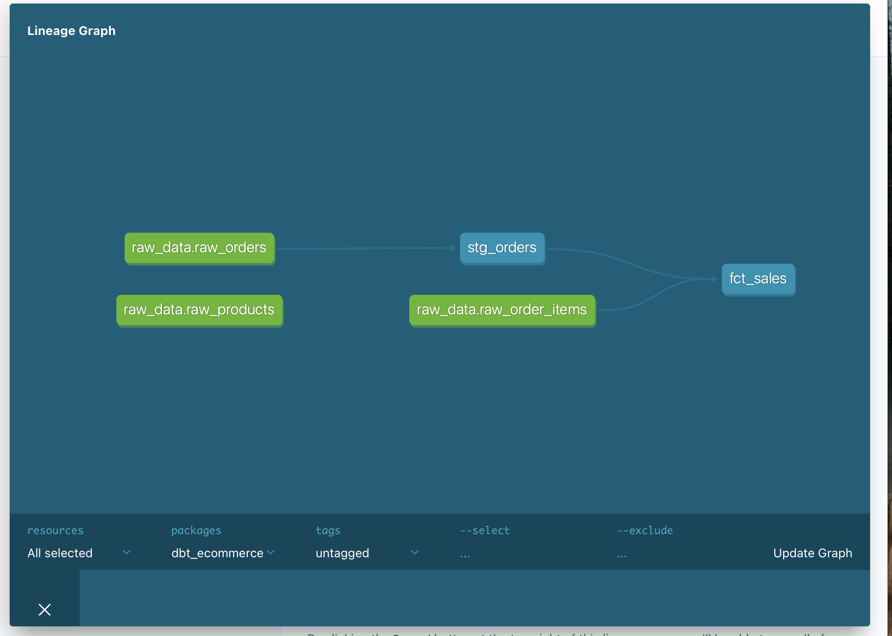

# 🚀 Modern E-Commerce ETL Pipeline (DuckDB + dbt)

Portofolio ini mendemonstrasikan pipeline ETL end-to-end menggunakan **Modern Data Stack** yang efisien, dirancang untuk menangani data kompleks (Brazilian E-Commerce Olist) dengan fokus pada integritas data dan arsitektur yang skalabel.

## 🏗️ Architecture & Medallion Layers
Proyek ini mengimplementasikan **Medallion Architecture** untuk memastikan kualitas data:
- **Bronze (Raw):** Ingestion menggunakan Python (`ingest_data.py`) dengan penambahan *Audit Metadata* (`loaded_at`).
- **Silver (Staging):** Pembersihan, casting tipe data, dan normalisasi menggunakan dbt models (`stg_orders`).
- **Gold (Marts):** Business logic siap pakai untuk analisis revenue dan performa penjualan (`fct_sales`).

## 🛠️ Tech Stack
- **Database:** DuckDB (In-process OLAP, performa tinggi untuk analytics).
- **Transformation:** dbt (Data Build Tool).
- **Programming:** Python & SQL.
- **Hardware:** Dioptimalkan untuk dijalankan pada resource terbatas (MacBook Pro 8GB RAM).

## 📊 Data Lineage

## ⚡ How to Run
1. Clone repo: `git clone https://github.com/USERNAME/ecommerce-etl-duckdb.git`
2. Activate venv: `source venv/bin/activate`
3. Install dependencies: `pip install -r requirements.txt`
4. Run Ingestion: `python scripts/ingest_data.py`
5. Run Transformation: `cd dbt_ecommerce && dbt run && dbt test`